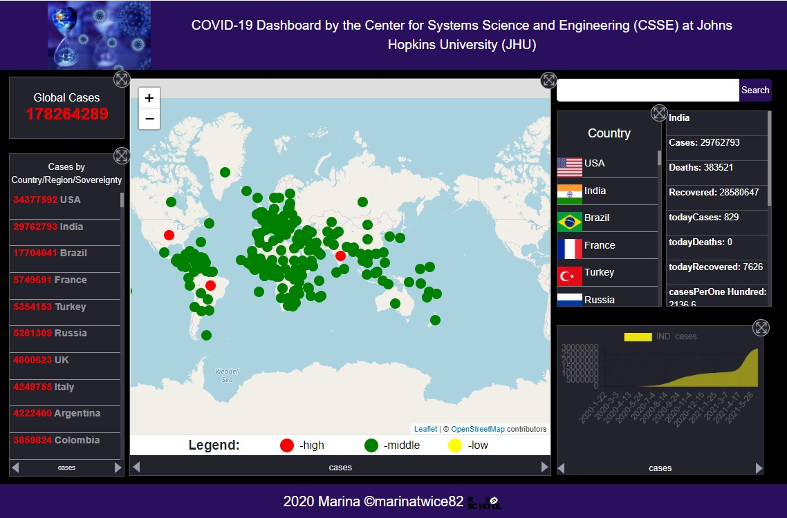

# Task 7. Covid-dashboard от [RSS School](https://rs.school/)

### **Проект Covid-dashboard[(готовый)](https://marinatwice82.github.io/covid-dashboard/)**

### Структура и особенности работы приложения
1. Таблица, в которой отображаются следующие данные:
    * количество случаев заболевания;
    * количество летальных исходов;
    * количество выздоровевших.

В таблице есть переключатели для отображения данных:
* за весь период пандемии и за последний день (последнюю возвращаемую API дату);
* в абсолютных величинах и из расчёта на 100 тыс. населения.

Страну можно выбрать:
* кликом по пункту списка;
* кликом по интерактивной карте;
* найти при помощи поиска.

2. Список стран для каждой из которых по умолчанию отображается общее количество случаев заболевания за весь период пандемии. У пользователя есть возможность выбрать для отображения в списке любой другой показатель из тех, которые могут отображаться в таблице. Список стран сортируется по убыванию по выбранному показателю. Работает поиск по названию страны. Поиск работает "на лету": по мере ввода названия страны отображаются все соответствующие введённым символам результаты. Результат поиска можно выбрать кликом, даже если поисковый запрос ещё не был введён полностью. Возле каждой страны выводится изображение её флага.

3. Интерактивная карта на которой условными обозначениями: цветом или размером маркера указывается интенсивность распространения болезни в разных странах. По умолчанию интенсивность определяется по общему количеству случаев заболевания за весь период пандемии. У пользователя есть возможность выбрать для определения интенсивности распространения болезни любой другой показатель из тех, что могут отображаться в таблице.
Карта интерактивная, есть возможность перетаскивать карту, уменьшать и увеличивать масштаб. При наведении курсора на страну появляется всплывающая подсказка - название страны и показатель, который в данный момент используется для определения интенсивности распространения болезни. У карты есть легенда. 

4. График по умолчанию строится по общему количеству случаев заболевания.

Данные в приложении обновляться ежедневно, в соответствии с обновлением данных, предоставляемых API. 

### [Описание задания](https://github.com/rolling-scopes-school/tasks/blob/master/tasks/covid-dashboard.md)